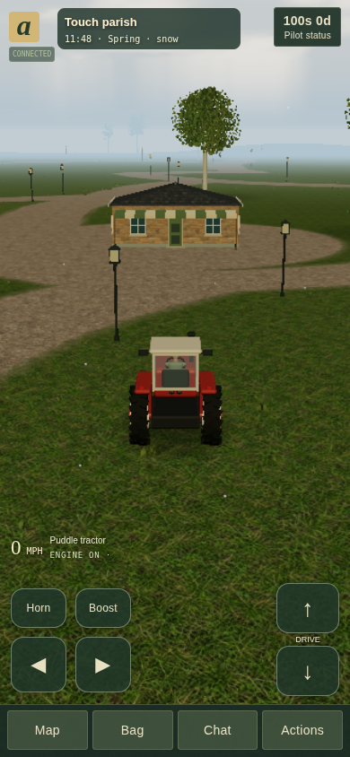

# Aclone

**A small, persistent universe with an unreasonable number of tractors.**

[Play the alpha](https://hromp.com/aclone) · [Player guide](docs/PLAYING.md) · [Release notes](docs/RELEASE_NOTES.md) · [Changelog](CHANGELOG.md)

**Version 0.34.0 · development alpha · GPL-3.0-or-later · Node.js 24.14+**

Aclone is an independent, open-source browser game inspired by _A tractor / The Universal_. Drive, trade, farm, run a business, employ neighbours and build a home—or create a world with your own rules. It uses original code, models, textures and synthesized sound, with no dependency on the original game's servers or assets.


## What you can do

- Build an economy: gather materials, grow six crops, process goods, set prices/wages and run shops or guesthouses. Supply rotating parish maintenance orders and read business statements and return reports; banks offer loans, mortgages and persistent credit histories.
- Live in a persistent world with seasons, storms, day/night lighting, survival and stocked homes that feed you offline. World owners can configure death penalties and inactivity limits. Configurable estates retain goods/capital and reprice unclaimed properties as equity and age change.
- Drive, fly, walk, fish, race, play Hornball/Ultrakricket, or join team combat and capture the flag.
- Travel among seven star systems; visit other trusted, self-hosted galaxies with a persistent identity and separate local progress.
- Create worlds with terrain/heightmaps, drawn paths, surface painting, fences, model scatter, custom models, uploaded GLB/OBJ models and PNG/JPEG textures, custom goods/professions/building templates, production-chain diagnostics, visual behavior rules, ordered quests, action requirements and optional Lua scripts with persistent player progress.
- Meet up to 19 optional AI neighbours with distinct personalities, memory and playing habits. All use Jev for decisions; Mabel chats through OpenAI, the others through Claude. API billing and operator spending limits are separate from consumer subscriptions.
- Play with desktop controls or a compact touch interface. Give neighbours money or help refuel their vehicles.

This is a playable alpha, not complete historical feature parity. See [status and limitations](docs/STATUS.md).

<details>
<summary>More gameplay screenshots</summary>





[Full screenshot gallery and asset sources](docs/ART.md)

</details>

## Run locally

```sh
git clone https://github.com/151henry151/Aclone.git
cd Aclone
npm ci
npm run dev
```

Open **http://127.0.0.1:3000**. Development mode reloads client code. For a production build:

```sh
npm run build
npm start
```

State lives in `var/aclone.sqlite`; keep this directory between runs. For LAN access, start with `HOST=0.0.0.0 npm start` and use the host's LAN address. Native startup inherits environment variables; to load a private `.env`, use `node --env-file=.env --import tsx src/server/main.ts` (add `--dev` for development).

## Deploy

Use a single Node process per database behind an HTTPS reverse proxy, or `docker compose up --build -d` with its persistent volume. For a URL such as `https://hromp.com/aclone/`:

```sh
BASE_PATH=/aclone npm run build
PUBLIC_ORIGIN=https://hromp.com/aclone/ npm start
```

The proxy must strip `/aclone` before forwarding, including WebSocket requests, and redirect `/aclone` to `/aclone/`. See [hosting](docs/HOSTING.md) for proxy examples, environment variables, SMTP, backups and restore; [releasing](docs/RELEASING.md) covers upgrades. Production deployment is operator-managed.

## Start playing

Drive with **WASD/arrows**, interact with **E/Ctrl**, open the map with **M**, inventory with **I**, and chat with **Enter**. On mobile, use the steering/throttle buttons and **Actions** menu.

1. Work a 15-second shift at the Odd Jobs Office for 45d.
2. Buy food and water at Harbour stores; consume them from Inventory. Expensive emergency bread/water imports remain available when shelves are empty; local producers are cheaper.
3. Learn a profession at school, take a funded job or save to buy a business.
4. Stock a home or rented room and go inside before logging off. **Hunger, thirst and starvation continue offline.**

Set a password and, where mail is configured, verify a recovery email in **Pilot & preferences**. Keep your pilot key private; export a fresh one after password sign-in. See [controls and FAQ](docs/FAQ.md) and [player guide](docs/PLAYING.md) for details.

## Contribute

Start with [CONTRIBUTING](CONTRIBUTING.md). Use tests for new behavior, keep money/state changes authoritative on the server, and update the relevant guide and changelog. No credentials, saved accounts or original-game research assets belong in commits or releases.

```sh
npm run check
npm run format:check
npm run build
npx playwright install chromium
# Start a disposable test server before browser tests:
npm run test:e2e
```

CI runs unit/type/format checks, two isolated browser shards, and deployed-build checks under `/aclone/`.

Browser tests may create pilots and worlds: never target production. `TEST_URL` selects the server; `CHROMIUM_PATH` selects an installed Chromium. Load/network checks are in [Hosting](docs/HOSTING.md#connection-and-multiplayer-checks); visual capture commands are in [Art](docs/ART.md#reviewing-visual-changes).

## Documentation

### Players and world creators

- [Playing](docs/PLAYING.md) — getting started, activities, farming, travel and survival.
- [Controls and FAQ](docs/FAQ.md) — key bindings and quick troubleshooting; also used by NPC help.
- [Mobile](docs/MOBILE.md) — touch controls, menus and device checks.
- [Economy](docs/ECONOMY.md) — prices, production chains, materials and lodging.
- [World building](docs/WORLD_BUILDING.md) — creator studio, custom models, rules and design transfer.
- [Scripting](docs/SCRIPTING.md) — Lua events, effects, examples and limits.

### Hosts and developers

- [Hosting](docs/HOSTING.md) — installation, HTTPS, email, backups and capacity checks.
- [Connected galaxies](docs/GALAXIES.md) — cross-server visits, trust and recovery.
- [AI neighbours](docs/NPCS.md) — setup, personality/memory, schedules, budgets and diagnostics.
- [Architecture](docs/ARCHITECTURE.md) — code map, authority, persistence and rendering boundaries.
- [Data](docs/DATA.md) — catalogs, units, saved fields and tuning.
- [Protocol](docs/PROTOCOL.md) — HTTP, actions and WebSocket snapshots.
- [Art](docs/ART.md) — models, rendering budgets, captures and screenshot gallery.
- [Texture prompts](docs/TEXTURE_PROMPTS.md) — original generation prompts and source provenance.
- [Status](docs/STATUS.md) — supported systems, limits and remaining fidelity work.
- [Releasing](docs/RELEASING.md) — checks, packaging and deployment procedure.
- [Release notes](docs/RELEASE_NOTES.md) — historical features, migrations and validation records.

## License

Code, configuration, documentation and original generated art/audio are **GPL-3.0-or-later**, unless a file says otherwise. See [LICENSE](LICENSE), [COPYRIGHT](COPYRIGHT), [third-party notices](THIRD_PARTY_NOTICES.md) and [security policy](SECURITY.md). Contributions use the same license.

_A tractor / The Universal_ belongs to its creators; Aclone is independent and not endorsed by them. The supplied spec and `sources/` are research, not relicensed assets, and are excluded from the client and release archive. The World Owners' Manual is attributed in the research spec; these guides use original wording.
