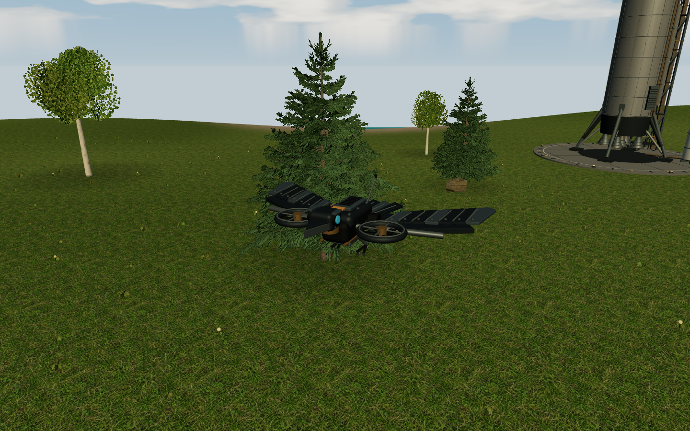
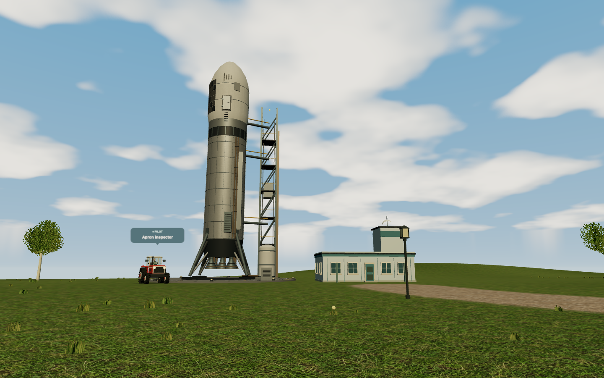
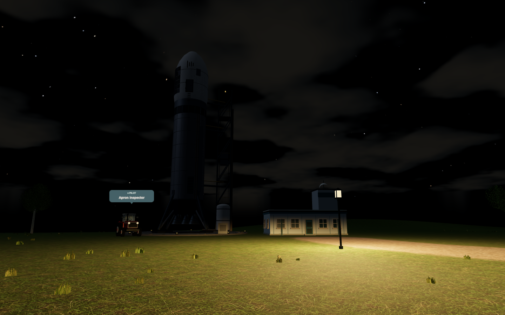
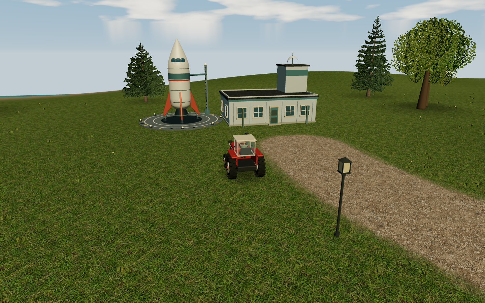
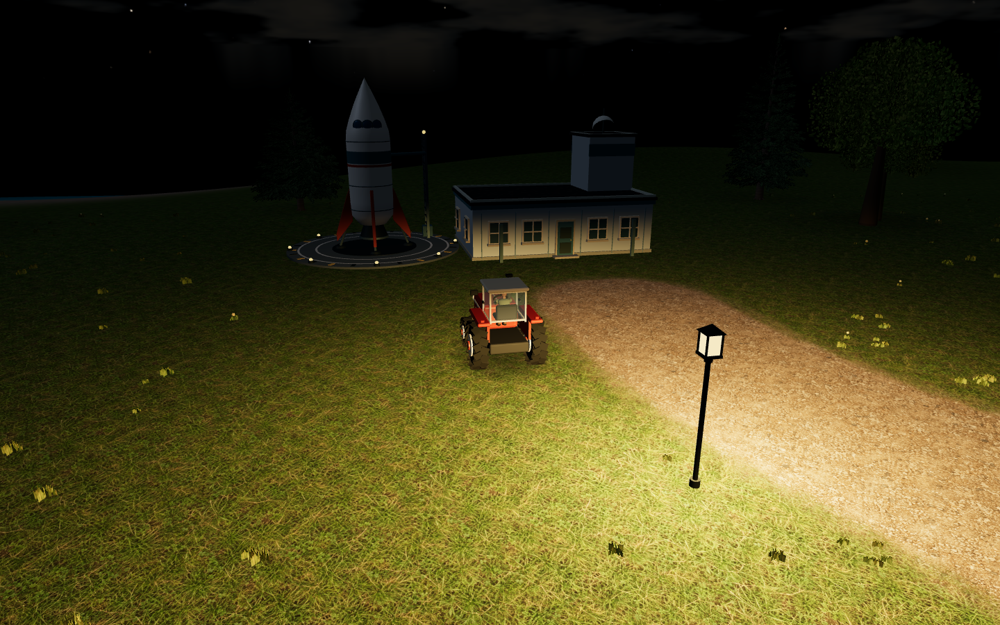

# Art direction and asset sources

Aclone aims for a warm, weathered English countryside: natural ground materials, worn lanes, limestone cottages, slate roofs, leafy silhouettes and readable machinery. The original game's village, country-lane and castle screenshots were inspected as visual references; none of their pixels, textures or models ship with Aclone.

## Natural gathering grounds

`src/client/resource-scenery.ts` authors four original resource landscapes: a
mixed-age grove around a felled tree and firewood rounds; weathered, chipped
boulders with loose spalls; a gravel hollow with a partly loaded wheelbarrow; and
an exposed earth bank with roots, clods and a shovel. Bark, end grain, foliage,
rock, soil and gravel use original procedural textures under GPL-3.0-or-later.
No purchased models, remote textures or additional lighting are needed.

Each site has a stable variant and at most five material batches, under 5,000
triangles in detailed mode and fewer in performance mode. Textures and materials
are shared across sites. Geometry follows terrain height; surrounding incidental
grass and trees leave clearings open. Existing seasonal material effects apply.

The 24 sites in `src/shared/resources.ts` have irregular positions around the
outskirts, at least 20 metres from road edges and 35 metres from starter building
centres. All remain within 150 metres of a road. The shared locations update the
map, gathering HUD and NPC navigation together. Existing IDs, capacity and
regrowth intervals are preserved, including saved depletion and reserved loads
in unfinished tasks. Deploy client and server together; no database reset is
needed. Custom-world terrain/buildings can still obstruct a site as before.

Run `CHROMIUM_PATH=/usr/bin/chromium npm run screenshots:resources` for actual
in-game captures of each site and a HUD gathering check, using a temporary server
and database. Output goes to `test-results/resources`; override it with
`SCREENSHOT_OUTPUT_DIR`. Geometry, placement, navigation and save compatibility
are covered by `tests/resource-scenery.test.ts`.

## Industrial robocrows (0.19.0)

`src/client/robocrow.ts` replaces the diamond-and-bar placeholder with an original
mechanical bird: overlapping metal flight feathers, exposed spars and actuators,
armoured ducted fans, a camera head with shaded cyan lenses, cooling vents,
fasteners, a battery cassette, split tail vanes and folded gripping claws.
An amber service cover and offset antenna add asymmetry. The roughly 5.2-metre
wingspan stays readable in the existing scouting view.

Fixed geometry is merged by material: seven body draws and two moving fan draws,
6,228 triangles in total. Only the two impellers rotate each frame; there are no
extra lights, transparent effects, downloads or animation allocations. All assets
are original procedural geometry under GPL-3.0-or-later. The upgrade applies to
local and remote robocrows, including custom vehicle slots using the robocrow mode.

Deployment, flight physics, inventory use and return-to-body controls are unchanged:
**R / F5** deploys or returns, **Insert / Delete** changes altitude. On touch screens
use **Actions → Toggle robocrow** and the flight controls. The browser test deploys,
climbs, moves and returns through the real input path, and captures this in-game
view of another scout using the same model:

`CHROMIUM_PATH=/usr/bin/chromium TEST_GPU=1 npm run test:e2e -- tests/browser/robocrow.spec.ts`

## Industrial spaceport (0.19.0)

The replacement spacecraft stands 32 metres tall, about eleven tractor heights,
with a 5.4-metre tank diameter and a 20-metre apron. Its cylindrical core supports
an asymmetric arrangement of service covers, thermal panels, exposed plumbing,
a 26-metre truss tower, umbilicals and a ground supply tank. Five open engine
bells, cooling rings and braced hydraulic legs replace the retro fins and single
nozzle. The crew hatch is two metres tall rather than scaled up with the ship.

All geometry and the subtle brushed-metal/runoff texture are original procedural
assets under the project's GPL license. A shared 128 × 256 texture and eleven
opaque materials keep the model compatible with static scenery batching. The
geometry test caps the apron kit at 45,000 triangles; no animated machinery,
additional dynamic lights or external downloads are introduced.

Shared collision/picking volumes cover the larger rocket, tower and supply tank.
The outer apron remains walkable, and the spaceport name stays above the terminal.
Existing spaceports acquire the design on update; deploy client and server together
for matching collision. Saved pilots inside an enlarged footprint can move outward.
The rocket remains scenery; use the terminal's **Take off to space** action to travel.

Run `CHROMIUM_PATH=/usr/bin/chromium TEST_GPU=1 npm run test:e2e -- tests/browser/spaceport.spec.ts`
to capture `test-results/industrial-spaceport-day.png` and
`industrial-spaceport-night.png` in a disposable world and verify terminal access
and takeoff. The daytime image includes an ordinary tractor beside the pad for scale.

## Spaceport apron (0.18.0)

`src/client/spaceport.ts` builds an original ten-metre retro rocket with a smooth
lathed hull, swept fins, splayed landing struts, nozzle, blue cockpit windows and
a teal/orange livery. A circular marked landing pad, service gantry and inset
amber beacons sit beside the existing control tower. The terminal uses painted
metal cladding. No external models, textures or downloads are added.

The opaque geometry joins the existing static scenery batches. Beacons use an
emissive material, with no extra dynamic lights, shadow maps or particle updates.
The shared building plan includes the apron for vegetation clearance and the
rocket/gantry for collision and picking; the outer pad remains walkable. These
are visual spaceport fixtures, not an additional player-pilotable vehicle.

## Synthesized sound

All runtime sounds are original code-generated mono PCM under GPL-3.0-or-later;
no recordings or external sample licenses are required. `sound-synthesis.ts`
creates diesel combustion pulses with resonant harmonics and filtered noise,
a two-tone horn, and saw/mill/hammer/furnace/pump loops. Buffers are cached per
AudioContext and have blended loop boundaries. `audio.ts` applies gain ramps,
smoothed playback-rate changes, stereo panning, a saved master volume and a
compressor to keep crowded scenes controlled.

`sound-scene.ts` selects at most 16 nearby continuous voices and 8 simultaneous
horns, independently of graphics quality. Brief fade-out tails can overlap a
replacement voice. Engines reach 110 metres, horns 150 metres and industry 90
metres, with continuous attenuation to silence at the boundary. The listener
stays at the player's rendered position, with the camera's viewing direction;
zooming overhead doesn't make the player's tractor inaudible. Remote source
positions use the same interpolation as the visible vehicles. No geometric
wall occlusion is modeled; being indoors applies a simple outside-volume cut.

`shared/sound-state.ts` projects running motors and production intensity from
server state; stock and wage predicates are shared with economic production.
Horn timestamps already present in snapshots identify accepted honks. Clients
baseline them on arrival and consume them while muted, so they don't play a
backlog. Context creation/resumption happens on a browser gesture; buffers and
nodes are not allocated for inaudible distant sources. The browser audio test
taps actual PCM after the output compressor and exercises a second WebSocket
player, ignition, revs, distance, horns, supplies, mute persistence and disconnect.

## Night sky

The night sky uses original procedural assets rather than astronomical photographs:
`starfield.ts` creates a seeded atlas of 4,600 stars with varied magnitudes and
colour temperatures. `sky.ts` shades two lunar discs using their surface normals
and the actual sun direction, with procedural maria and crater detail. Stars and
moons render behind the same cloud layer, in one sky draw. `astronomy.ts` defines
a fictional 45° northern observer, 23.4° axial tilt, a 365-day year and a close
moon pair with a 28-day synodic cycle and five-day mutual orbit. This is a
readable fictional orbital model, not an N-body simulation or a recovered rule
from the original game. The shared absolute calendar keeps it stable across
reconnects. Ground moonlight reuses the sun's shadow-casting light at night;
`sky-weather.ts` samples the same cloud texels as the sky shader to attenuate it.
The apparent lunar radii (1.1° and 0.56°) are deliberately larger than Earth's
Moon for readability. These assets are covered by the project's GPL license.

## Evergreen woodland

`evergreen.ts` replaces the former solid cones and circular foliage stamps with
three seeded spruce/fir profiles. Tapered, gently curved trunks carry staggered
branch tiers, drooping lower boughs and smaller ascending growth near the leader.
Each bough carries irregular lateral shoots and a terminal spray. Original canvas
textures draw woody axes and individual needles, plus fissured grey-brown bark;
no photographs, external models or extra image downloads are required.

Twisted, crossed cutout planes give each small spray volume. Alpha testing retains
ragged edges and avoids transparent sorting. A modest back-light term approximates
light transmission through needles, using scene lights rather than emissive glow.
Seasonal shader decoration preserves this material's distinct shader cache key;
needles retain their green tint in autumn and collect snow on upward surfaces.

The whole woodland uses at most six instanced meshes (wood and needles for each
profile), with no mesh per twig. Each tree has fewer than 11,000 triangles in
detailed mode; performance mode removes selected secondary sprays and reduces
branch sides/segments, staying below 80% of that geometry. It retains exactly the
same trunk and bough layout. Seeded size, width, lean and rotation vary instances.
Existing grove, grass and deciduous-tree placement remain stable.

Run `SCREENSHOT_GPU=1 npx tsx scripts/evergreens.ts` for front, close, side, distant
and snowy in-game views on a disposable development server. It selects an existing
evergreen in the normal seeded countryside; it does not substitute a showcase
model. `SCREENSHOT_QUALITY=low` checks performance geometry; omit
`SCREENSHOT_GPU` to check software WebGL. `CHROMIUM_PATH` selects a local Chromium,
and `SCREENSHOT_OUTPUT_DIR` changes the default `test-results/evergreens` folder.
The captures inspect browser errors and report render counts. Geometry tests guard
against non-finite vertices, oversized meshes and changed shapes between modes.

## Material textures

The four original materials in `public/textures/` were generated with the built-in OpenAI image-generation tool on 2026-09-29. No reference images were submitted to that tool. They are distributed under this project's GPL-3.0-or-later license. They are generated illustrations of surfaces, not measured physical scans. Master PNGs were exported as WebP at quality 88 without resizing; the shipped set totals about 2.7 MiB. The original full-resolution PNG masters are included in `art/materials/` and in source archives; they are kept out of the browser bundle. Edit those masters and export the runtime WebP files with `convert art/materials/stone.png -quality 88 public/textures/stone.webp` (ImageMagick, only needed when re-exporting art). Generation prompts are preserved below for contributors.

### meadow.webp

Use case: photorealistic-natural. Asset type: original seamless square game ground albedo texture, for a GPL open-source countryside driving game. Straight-down orthographic surface scan of English meadow turf: fine dense mixed olive and forest-green grasses, tiny clover leaves, occasional dry straw and earth visible underneath. Natural irregular variation across multiple scales, small detailed blades, subdued realistic greens, no neon, no large flowers. Completely fills the square edge to edge, visually seamless repeating edges, uniform flat overcast illumination, no perspective, no cast shadows, no vignette, no objects, no text or watermark. This is a flat material texture, not a landscape photograph. Fine surface detail readable close-up. Output one square image.

### gravel.webp

Original game material texture, square seamless repeating albedo. Top-down orthographic scan of a weathered English country lane: compact warm grey-brown limestone dust, small irregular pale grey gravel pebbles, fine sand and subtle muddy earth, occasional darker embedded stones. Realistic intricate fine detail with gentle broad mottling, no markings, no grass, no wheel tracks, no large rocks. Flat neutral overcast lighting, no shadows or perspective or vignette, edge-to-edge tileable surface, no text. One texture image for a countryside driving game.

### stone.webp

Original seamless square game albedo texture of old English cottage limestone masonry. Front-on orthographic flat surface: small irregular horizontal courses of warm grey and honey limestone blocks, subtly weathered grain, narrow recessed sandy lime mortar, muted natural pale stone. Stones roughly hand-cut with softly worn edges and varied widths, six to eight courses across image height. No dramatic shadows, uniform overcast illumination, no perspective, no vignette, no border, no objects or text. Realistic fine material detail, subtle colour variation. Edge-to-edge seamlessly repeating texture, one image.

### roof.webp

Original seamless square game albedo texture of weathered charcoal blue-grey slate roof tiles. Straight-on orthographic flat material scan, staggered horizontal courses of small rectangular natural slates, subtle chipped edges, mineral grain and faint weathering, fine seams. Muted dark blue-grey with restrained moss traces, no bright highlights. Flat uniform overcast illumination, no perspective, no cast shadows, no vignette, no text. Edge-to-edge repeating surface with seamless borders. One original material image for a countryside game.

## Renderer conventions

- `materials.ts` owns shared textures for the page lifetime. World and vehicle disposal must not destroy shared maps. All URLs use the configured public base, including `/aclone/`.
- Building UVs are measured in metres. Subtle bump relief comes from the albedo luminance; these are not calibrated height maps. Terrain samples the meadow every five metres and gravel every six, with a noisy transition at verges and shorelines. Roads remain aligned with the original village layout.
- `noise.ts` precomputes a small noise texture, avoiding expensive per-pixel trigonometry. `sky.ts` layers that noise into cloud cover and a solar halo.
- `scenery.ts` creates deterministic grass, leaf cards, trees, gardens and contact shade. Roads, building approaches and sports areas are kept clear. Alpha-tested foliage and instancing reduce sorting and draw overhead; scenery has no authoritative collision or economic effect.
- `tractor.ts` owns the original cab, bonnet, grille, lights and treaded wheels, and places the seated `human.ts` figure in its seat. Batch the body and each animated axle separately. Normalize indexed/non-indexed geometry before merging.
- Textured opaque scenery batches by material properties and texture identity, not colour alone. Transparent windows remain separate. Contact shade remains visible when dynamic shadows are disabled. Multisample antialiasing is opt-in for detailed mode, so software fallback can reduce rendering cost without recreating the WebGL context.

## Reviewing visual changes

Run `npm run screenshots` against a disposable local server with `TEST_URL` set. It creates a pilot and a world, checks for console/page errors, and captures actual gameplay; see `scripts/screenshots.ts`. `SCREENSHOT_QUALITY=low`, `balanced`, or `high` selects performance, adaptive, or detailed respectively. Dynamic shadows now default off in all modes; the separate saved shadow preference can enable them outside performance mode. A GPU is recommended for detailed captures. `SCREENSHOT_GPU=1` opts into desktop OpenGL/ANGLE hardware rendering for captures on a supported local machine; the default uses SwiftShader for reproducibility. The capture prints the actual graphics device so a fallback is visible. Set `SCREENSHOT_HERO_ONLY=1 SCREENSHOT_QUALITY=high` to additionally capture `scenery.png` using the H-key view and an orbit/zoom, skipping the trading and editor captures. Never substitute a concept render for a gameplay screenshot.

Check driving-height close-ups, distant terrain, road edges, building sides and roof UVs, all camera modes, changed terrain, and both root and subpath builds. The viewport canvas exposes `data-draw-calls` and `data-triangles` for diagnostics. Software-renderer timings are not representative of a hardware GPU, but controls must remain responsive in performance mode. The four textures should load once, not every world update.

## Human figures

`src/client/human.ts` is the editable source for the original walking and seated
figures; it does not download models, face images or animation files. Smooth
profile geometry shapes the head, torso and limbs, with modeled face features,
fingers, collar, pockets, cap and boots. A small deterministic procedural weave
provides cloth bump detail. The model is stylized, not a scanned human likeness.
Code and generated geometry are GPL-3.0-or-later like the rest of Aclone.

The walking figure keeps hip, knee, ankle, shoulder and elbow pivots. A two-bone
leg solver keeps the boot soles above the ground; distance from the interpolated
visual pose advances the gait, which blends back to rest on stopping. The seated
pose is baked into three vertex-coloured material batches. Walkers use at most
24 draws and both figures stay below 22,000 triangles, enforced by tests. Immutable geometry, materials and the cloth weave are cached for the page
lifetime. Each figure clones its joint hierarchy, so animations stay independent;
disposal must respect the shared resource flags. Camera changes hide only the local occupant in first-person views.

Run `TEST_URL=http://127.0.0.1:3000 SCREENSHOT_GPU=1 npm run screenshots:characters`
against a disposable server with a hardware-capable browser to capture the
standing character, walking pose and driver. `CHROMIUM_PATH` can select a locally
installed browser. Omit `SCREENSHOT_GPU` to use software rendering (slower).
Captures use the real inventory actions and scenery view, and fail on browser
errors. See `scripts/characters.ts`; no mockup is substituted for gameplay.

## Scale and architecture (0.3.4)

One world unit is treated as one metre. The adult figure is about 1.8 m tall;
tractors are about 2.85 m tall and 2.6 m wide, with a 2.5 m cockpit eye position.
The driver retains exactly the same body size when seated. Ordinary door leaves
are 2.1 m tall, cottage eaves 2.7 m and two-storey eaves around 5.4 m. Workshops
have larger 3.2 m vehicle doors. Village lamps are about 4 m, bench seats about
0.5 m, and mature trees roughly 7–15 m tall. These are design proportions for
this stylized game, not replicas of a particular manufacturer's dimensions.

`src/shared/building-shapes.ts` owns deterministic building volumes in metres.
The renderer, planting clearance, picking and authoritative movement collision
use those same plans. Cottage variants depend on stable building IDs, not names
or random frame state. `src/client/buildings.ts` supplies gable, hipped, shed and
flat roofs, wings, consistent joinery, timber framing, striped shop awnings,
workshop bays, a mill wheel and civic/industrial landmarks. Material UVs retain
metre-based tiling rather than stretching with the size of the building. All
models remain original procedural GPL-covered source; there are no new assets
or external downloads. Static details still participate in world batching.

Run `TEST_URL=http://127.0.0.1:3000 SCREENSHOT_GPU=1 npx tsx scripts/streets.ts`
on a disposable instance for village, cottage, pub, mill, shop, school and human
scale screenshots. It uses real registration, world creation and owner teleport
commands, and checks browser errors. `CHROMIUM_PATH` is supported. The character
capture also shows the resized cab. Review first-person views after changing cab
or seat dimensions, and test both root and `/aclone/` builds.

## Seasonal and customization work (0.4.0)

Cottage siding and paint swatches are original data-driven variants in
`appearance.json`. Timber walls use horizontal board seams and matching gables;
style keys are saved at construction. Chimney emitter tips are part of each
building model. Occupancy is authoritative; smoke particles are visual only.

Seasonal coverage is a shader uniform on terrain, upward-facing static surfaces
and foliage, with autumn tinting. The sky and directional light share the solar
trajectory. Rain/snow and smoke use bounded point pools. Nearby farm plots use
instanced stalks/leaves and update at four growth stages; projectiles use one
bounded instanced draw instead of a mesh allocation per shot.

Build, then run `SCREENSHOT_GPU=1 npx tsx scripts/seasons.ts` to reproduce the
seasonal/cottage/farm/galaxy images. It owns a disposable server and uses staged
world dates and crop state, followed by real UI actions including harvesting.
It checks page/console errors and cleans up its database. Use `CHROMIUM_PATH`
when the installed Chromium is outside Playwright's default location.

## Living villages (0.5.0)

Windows are merged per building with separate emissive control. Up to twelve pooled spotlights (four in performance mode) illuminate the nearest active windows and street lamps; the budget is
independent of player count. Windows aim outward and down. Lights do not cast
additional shadow maps. Unlit nights use almost no ambient light; headlamps remain
available in every graphics mode. Lightning combines a brief cloud flash and bolt.

Evergreen groves now use the branched needle-spray models described above; birches use generated bark
markings and narrower crowns. Spatial seed regions group species and sizes vary.
These are code-generated original assets; no new external images are needed.

Run `npm run screenshots:living` for the disposable booking/gathering walkthrough
and night/headlight/snowstorm comparisons. `SCREENSHOT_GPU=1` opts into hardware
headless rendering; `CHROMIUM_PATH` can select a local Chromium executable.
