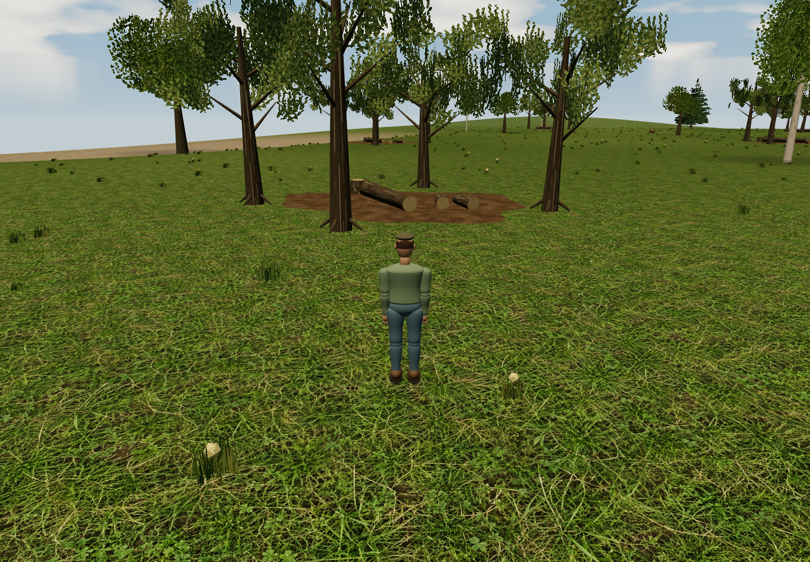
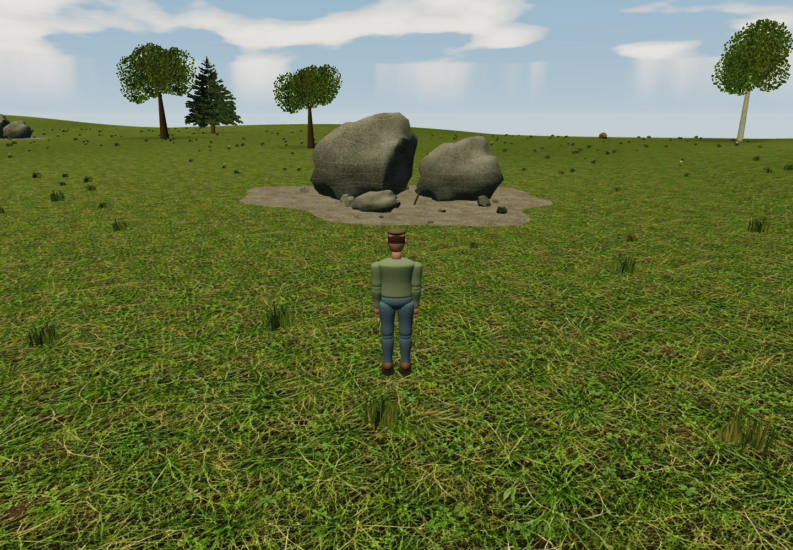

# Art and visual verification

Warm, weathered countryside, readable machinery and consistent metre-scale forms. Original-game screenshots informed direction; none of their pixels/models ship. Original procedural geometry, sounds and generated textures use GPL-3.0-or-later. [Texture provenance/prompts](TEXTURE_PROMPTS.md) preserves exact generation instructions and master-export commands.

## Natural gathering grounds

`client/resource-scenery.ts`: a grove/felled tree/firewood, chipped boulders/spalls, gravel hollow/wheelbarrow and exposed soil/roots/shovel. Original procedural bark/grain/foliage/rock/soil textures; shared seasonal materials, terrain-following geometry, clear surrounding vegetation. Stable variants use ≤5 batches and <5,000 detailed triangles/site, fewer in Performance.

`shared/resources.ts` places 24 grounds ≥20m from road edges, ≥35m from starter centres, ≤150m from a road. Map/HUD/NPCs share coordinates. Stable IDs preserve reserves/regrowth/tasks; custom terrain/buildings can obstruct sites. Client/server must update together. `tests/resource-scenery.test.ts` checks geometry, placement/navigation and save compatibility.

## Industrial robocrows (0.19.0)

`client/robocrow.ts`: 5.2m mechanical wings, overlapping feathers, actuators/spars, ducted fans, camera lenses, vents, fasteners, battery, split tail, claws and asymmetric service cover/antenna. Seven body draws + two rotating fans, 6,228 triangles; no extra lights/downloads/per-frame allocation. Used by local/remote and custom robocrow-mode slots; gameplay unchanged.

## Industrial spaceport (0.19.0)

`client/spaceport.ts`: ~193m cargo launcher (six times its earlier size), 120m apron, asymmetric panels/plumbing, ~158m truss/umbilicals, service tank, five engine bells and hydraulic legs. Crew hatch stays 2m. The industrial terminal adds cargo, control and utility wings. Shared materials join static batches; the launch kit remains below 45,000 triangles without new lights or animation. Shared footprints keep solid hardware and the walkable pad inside the starter map.

Shared collision/picking covers rocket/tower/tank; apron is walkable, label/entrance stay at terminal. Trapped saved pilots can move outward. The rocket is scenery: terminal Take off handles travel. [Day](screenshots/industrial-spaceport-day.png), [night](screenshots/industrial-spaceport-night.png).

## Spaceport apron (0.18.0)

Historical design, replaced in 0.19.0: 10m lathed retro hull, fins, struts/nozzle, blue windows and teal/orange livery; circular marked pad, gantry, amber emissive beacons and metal terminal cladding. Static original geometry without extra dynamic lights; shared footprint left the pad walkable. [Archived day](screenshots/spaceport-day.png), [night](screenshots/spaceport-night.png).

## Synthesized sound

`sound-synthesis.ts` generates mono PCM diesel pulses/harmonics/noise, two-tone horns and saw/mill/hammer/furnace/pump loops; cached/loop-blended per AudioContext. `audio.ts` ramps gain/rate, pans, applies saved master volume and compresses crowds. No external samples/licenses.

`sound-scene.ts` caps 16 continuous voices +8 horns (brief fading tails may overlap); engine/horn/industry ranges 110/150/90m. Listener follows displayed player position and camera direction, not zoom height; remote sounds interpolate with models. Indoors muffles outside; no geometric wall occlusion. Server `sound-state.ts` shares production predicates. Honks baseline on arrival/while muted, preventing replay. Gesture-unlocked contexts allocate only audible sources. Browser audio tests measure mixed PCM after compression with real remote sockets.

## Night sky

`starfield.ts`: seeded atlas of 4,600 varied-magnitude/color stars. `sky.ts`: procedural cratered lunar discs shaded from normals/sun, behind the same clouds in one draw. `astronomy.ts`: fictional 45°N observer, 23.4° tilt, 365-day year, 28-day synodic and five-day mutual moon cycles. Lunar radii 1.1°/0.56° exaggerate readability. Shared calendar preserves continuity. Moonlight reuses the sun light; `sky-weather.ts` samples matching cloud texels. Not an N-body or recovered historical model.

## Evergreen woodland

`evergreen.ts`: three seeded spruce/fir profiles, curved tapering trunks, staggered drooping boughs, lateral shoots and terminal sprays. Canvas needles/axes and fissured bark need no downloads. Twisted crossed alpha-tested planes avoid sorting; modest backlight uses scene lights, not glow. Seasonal shader cache identity is preserved; green autumn needles gather snow on top.

At most six instanced meshes (wood/needles per profile), <11,000 triangles/tree detailed; Performance removes secondary sprays/reduces branch segments to <80%, keeping trunk/bough layout. Seeded size/lean/rotation varies trees; grove/deciduous/grass placement remains stable.

## Renderer conventions

- `materials.ts` owns shared maps for page lifetime; disposal must preserve them. URLs respect BASE_PATH. Four WebPs total ~2.7 MiB; full PNG masters ship in source archives, not browser bundles.
- Metre-based UVs; albedo luminance gives uncalibrated bump. Meadow repeats at 5m, gravel 6m, noisy verge/shore transitions following shared roads.
- `noise.ts` precomputes noise; `sky.ts` uses it for clouds/halo. `scenery.ts` seeds instanced grass/leaf cards/trees/gardens/contact shade, keeping routes/sports clear; incidental scenery has no authoritative collision/economy.
- `tractor.ts` batches body/animated axles and seats `human.ts`; normalize indexed/non-indexed geometry before merging. Opaque batches key on texture/surface, not just color; glass stays separate.
- Contact shade remains without dynamic shadows. Antialiasing is detailed-only; software fallback can reduce cost without recreating WebGL. Dynamic shadows default off, separately opt-in outside Performance.

## Human figures

`human.ts` supplies original smooth workwear humans: face/fingers/collar/pockets/cap/boots and procedural cloth weave. No scanned likeness/model downloads. Walkers clone joint hierarchies over shared geometry/materials; two-bone legs follow interpolated distance and blend to rest. Seated drivers bake into three batches; walkers ≤24 draws, both <22,000 triangles. First-person hides local occupants; eye height 1.68m. Respect shared-resource flags on disposal.

## Scale and architecture (0.3.4)

One unit = 1m. Adult ~1.8m; tractor 2.85m high/2.6m wide, cockpit eye 2.5m; seated humans retain scale. Doors 2.1m, cottage/two-storey eaves 2.7/5.4m, workshop doors 3.2m, lamps 4m, bench seats 0.5m, mature trees 7–15m. Stylized proportions, not manufacturer replicas.

`shared/building-shapes.ts` supplies deterministic volumes for render/collision/picking/clearance; variants depend on stable IDs. `buildings.ts` supplies roofs/wings/joinery/awnings/bays/mill wheel and civic/industrial silhouettes. UVs retain metre tiling; details join static batching. Check first-person after seat/cab changes.

## Seasonal and customization work (0.4.0)

`appearance.json` defines cottage siding/paint; saved styles select board seams/gables. Chimney tips are model emitters; occupancy is authoritative, smoke visual. Seasonal uniforms affect terrain/upward surfaces/foliage; sun/sky share trajectory. Bounded rain/snow/smoke pools, four-stage instanced crops and one bounded projectile draw avoid per-frame allocations.

## Living villages (0.5.0)

Merged window panes have separate emissive control. Twelve pooled window/street spotlights (four Performance) aim outward/down without extra shadows; budgets do not scale with players. Dark nights retain headlights/natural sky light. Lightning combines cloud flash/bolt. Seed regions group evergreen/birch species; birches have procedural markings/narrow crowns and varied sizes.

## Reviewing visual changes

Use disposable worlds, never concept art presented as screenshots. `CHROMIUM_PATH` chooses Chromium. Captures default to SwiftShader; `SCREENSHOT_GPU=1` selects supported hardware and reports the actual device. `SCREENSHOT_QUALITY=low|balanced|high` selects Performance/Adaptive/Detailed; `SCREENSHOT_OUTPUT_DIR` changes output. Software timings do not predict GPU performance.

- `TEST_URL=... npm run screenshots`: creates pilot/world, checks browser errors, captures game/trade/editor. `SCREENSHOT_HERO_ONLY=1 SCREENSHOT_QUALITY=high` captures H-key scenery only.
- `npm run screenshots:characters` and `npx tsx scripts/streets.ts`: disposable TEST_URL server, real walking/driver/cottage/pub/mill/shop/school/scale actions.
- `npm run screenshots:town`: isolated expanded-town/service-access check.
- `npm run screenshots:seasons`: owned disposable server, staged dates/crops, real harvest and space actions.
- `npm run screenshots:living`: booking/gathering and night/headlights/snowstorm comparisons.
- `npm run screenshots:resources`: all four grounds and HUD gathering; defaults `test-results/resources`.
- `npx tsx scripts/evergreens.ts`: seeded real-tree front/side/close/distant/snow views, errors/render counts; defaults `test-results/evergreens`.
- After build, `npx tsx scripts/night-lighting.ts`: real L toggle, midnight/day comparison; defaults `test-results/night-lighting`.
- `npx tsx scripts/night-sky.ts`: full/half/crescent/overcast/day, two hours' movement, same ground under moon/stars/cloud; defaults `test-results/night-sky`.
- `npm run test:e2e -- tests/browser/spaceport.spec.ts` and `tests/browser/robocrow.spec.ts`: real takeoff/dock scale and drone deployment/flight/return; `TEST_GPU=1` requests hardware.

Check driving-height and distant views, terrain edits, UVs/road edges, all cameras, root and `/aclone/` builds, both graphics modes. Canvas `data-draw-calls`/`data-triangles` expose counts. Textures should load once, not per snapshot. Captures fail on browser errors; geometry tests guard finite vertices/budgets/layout. Script-specific output directories live under `test-results/` unless overridden.

## Screenshot gallery

Actual renderer captures; many use staged disposable worlds. They demonstrate visuals, not production deployment. NPC chat capture uses a scripted reply; historical live API trials are in [release notes](RELEASE_NOTES.md#historical-npc-provider-trials).

- [Character](screenshots/character.png)
- [Cottage](screenshots/cottage.png)
- [Crescent moons](screenshots/crescent-moons.png)
- [Dark countryside](screenshots/dark-countryside.png)
- [Dock fishing desktop](screenshots/dock-fishing-desktop.png)
- [Dock fishing phone](screenshots/dock-fishing-phone.png)
- [Driver](screenshots/driver.png)
- [Editor](screenshots/editor.png)
- [Evening inn](screenshots/evening-inn.png)
- [Evergreen close](screenshots/evergreen-close.png)
- [Evergreen](screenshots/evergreen.png)
- [Farm plots](screenshots/farm-plots.png)
- [Farming](screenshots/farming.png)
- [Galaxy routes](screenshots/galaxy-routes.png)
- [Galaxy](screenshots/galaxy.png)
- [Gather hud desktop](screenshots/gather-hud-desktop.png)
- [Gather hud phone](screenshots/gather-hud-phone.png)
- [Gathering](screenshots/gathering.png)
- [Guesthouse](screenshots/guesthouse.png)
- [Headlights](screenshots/headlights.png)
- [Human scale](screenshots/human-scale.png)
- [Industrial robocrow](screenshots/industrial-robocrow.png)
- [Industrial spaceport day](screenshots/industrial-spaceport-day.png)
- [Industrial spaceport night](screenshots/industrial-spaceport-night.png)
- [Lodging](screenshots/lodging.png)
- [Mill](screenshots/mill.png)
- [Mobile landscape](screenshots/mobile-landscape.png)
- [Mobile portrait](screenshots/mobile-portrait.png)
- [Moonlit ground](screenshots/moonlit-ground.png)
- [Night town](screenshots/night-town.png)
- [Npc chat](screenshots/npc-chat.png)
- [Parish map](screenshots/parish-map.png)
- [Parish](screenshots/parish.png)
- [Pub](screenshots/pub.png)
- [Scenery](screenshots/scenery.png)
- [School](screenshots/school.png)
- [Shops](screenshots/shops.png)
- [Snowstorm](screenshots/snowstorm.png)
- [Spaceport day](screenshots/spaceport-day.png)
- [Spaceport night](screenshots/spaceport-night.png)
- [Sprawling town](screenshots/sprawling-town.png)
- [Starlit ground](screenshots/starlit-ground.png)
- [Stone outcrop](screenshots/stone-outcrop.png)
- [Sunset](screenshots/sunset.png)
- [Task countdown desktop](screenshots/task-countdown-desktop.png)
- [Task countdown phone](screenshots/task-countdown-phone.png)
- [Town overview](screenshots/town-overview.png)
- [Trading](screenshots/trading.png)
- [Twin moons](screenshots/twin-moons.png)
- [Village](screenshots/village.png)
- [Walking](screenshots/walking.png)
- [Winter](screenshots/winter.png)
- [Wood cottage](screenshots/wood-cottage.png)
- [Woodland clearing](screenshots/woodland-clearing.png)
- [Woodland](screenshots/woodland.png)

## Livestock

Original articulated cow, sheep, pig and chicken meshes use smooth anatomy, procedural coat/fleece/feather detail and shared instanced rendering. No downloaded animal assets. `CHROMIUM_PATH=/usr/bin/chromium npm run screenshots:livestock` captures close-ups of the actual meshes with preview lighting in `test-results/livestock/`; the browser livestock test captures the live game.
