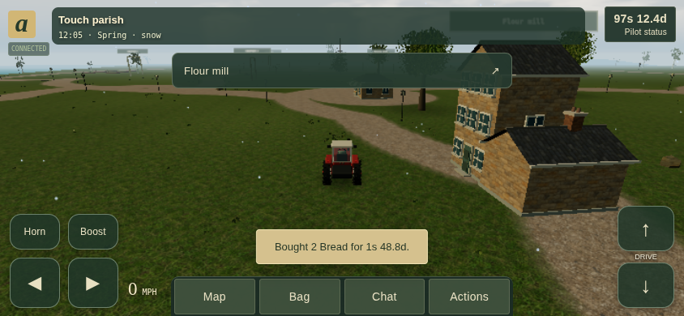

# Playing on a phone or tablet

The compact interface opens automatically on phone-sized windows and touch tablets.
Rotate between portrait and landscape whenever you like. Large desktop screens
keep the full HUD and existing mouse/keyboard controls. No installation is needed.

## Driving and looking around

Use two thumbs: **◀ / ▶** on the left steer, and **↑ / ↓** on the right drive
forward or reverse. Hold both steering and throttle together to turn while moving.
Release to slow down. **Boost** gives extra speed and uses more fuel; **Horn**
also pushes the ball during Hornball. The same arrows control walking.

Drag the scenery to turn the camera; in first-person, drag vertically to look up
or down. Pinch the scenery to zoom. **Actions → Change camera / Zoom in / Zoom out**
provide buttons too. Camera gestures never operate through a menu or chat panel.

Use **Actions** to start/stop the engine, change headlights, switch between walking
and your tractor, deploy a robocrow, or change sound settings. Aircraft display
**Climb / Descend** beside the pedals. Worlds with fighting enabled display **Fire**;
choose a weapon in Actions. Tap Fire for ordinary weapons, or hold and release
for a javelin. Cancelling a touch does not release a charged throw.

Opening a panel, changing orientation, typing, losing focus or disconnecting
releases held controls. Close the panel and press again to drive. Tasks and being
indoors also prevent movement. These controls send the same ordinary server inputs
as a keyboard; movement, fuel and collision rules are unchanged.

## A clear view of the world

Only the clock, cash/status, speed, navigation and driving controls stay visible.
A nearby-building button appears below the clock. Tap it to trade, work or enter;
when indoors it becomes **Go outside**. Task progress appears here too. While fishing,
a centered **Reel in** button lights up when a fish bites; tap it within eight seconds.

- **Map** opens the named parish map. Swipe to pan, use +/− to zoom, or open
  **Parish directory** for a list with larger targets and distances.
- **Bag** opens every carried item. Use food, drink or fuel directly here.
- **Chat** opens public/private conversation and swipeable history. New-message
  indicators appear on its button. Tap the input to bring up the keyboard; sending
  keeps it ready for your next message. **Done** closes chat and releases the keyboard.
- **Actions** includes resources, activities, construction, skills, neighbours,
  the world editor, account preferences and help. Full farming, trading, business
  administration and galaxy features use the same forms as desktop.
- Tap **cash / Pilot status** for health, hunger, thirst, fuel and the parish list.
  This button highlights urgent hunger, thirst, health or fuel needs.

Menus fit the available screen, including when the browser keyboard reduces it.
Their close button stays at the top while you scroll. Swipe building tabs sideways
if needed. Trading lists and edited amounts retain their position/values when you
repeat a transaction. Touch targets are at least 44 CSS pixels, except map labels;
the map's zoom buttons and directory offer alternatives for tightly packed labels.

## Accounts, performance and survival

Sign-in, password recovery, world selection and space travel work from the same
browser. Use **Actions → Pilot & preferences** to save a password, verify a recovery
email (where configured), adjust sound or select Performance graphics. Existing
quality preferences are respected; mobile layout does not change desktop quality.
Sound begins after your first tap, subject to browser/device volume settings.

Leaving the browser does not pause the world. Stock a home or rented room with
food and water and go inside before signing off. Offline hunger and thirst can kill
your character. An interrupted connection shows its status near the game-menu icon;
controls start released after reconnection, and server-saved progress remains.

## Developer notes and verification

`src/client/mobile.ts` owns adaptive layout, pointer ownership and temporary
chat/status panels. `mobile.css` scopes all compact overrides to `.mobile-ui`.
The breakpoint is a viewport at most 800 CSS pixels wide, or a primary coarse
pointer with width at most 1366 pixels. It does not guess from user-agent strings.
The normal desktop CSS and keyboard bindings remain available.

The compact UI moves the existing target element and reuses the existing chat and
status DOM. It never duplicates chat history or form state. Each held control owns
its pointer ID; release/cancel/lost capture removes only that pointer. Input packets
continue through the existing bounded `InputStream`, with panels masking movement.
VisualViewport resize/scroll updates sheet height/offset for virtual keyboards;
dynamic viewport units and safe-area insets handle browser chrome and notches.
Native scrolling is retained on forms, history and the map. Only driving buttons
and the 3D canvas suppress native touch gestures.

Run `CHROMIUM_PATH=/usr/bin/chromium TEST_GPU=1 npm run test:e2e -- tests/browser/mobile.spec.ts`
for disposable-world touch tests. The regular browser suite covers desktop controls,
subpath hosting, retained form values, multiplayer and account recovery. Screenshots
are saved under `test-results/`. Test on physical Android Chrome and iOS Safari before
claiming device-specific keyboard, browser toolbar or thermal performance results:
Chromium emulation verifies layout and multi-touch, not those hardware behaviours.
